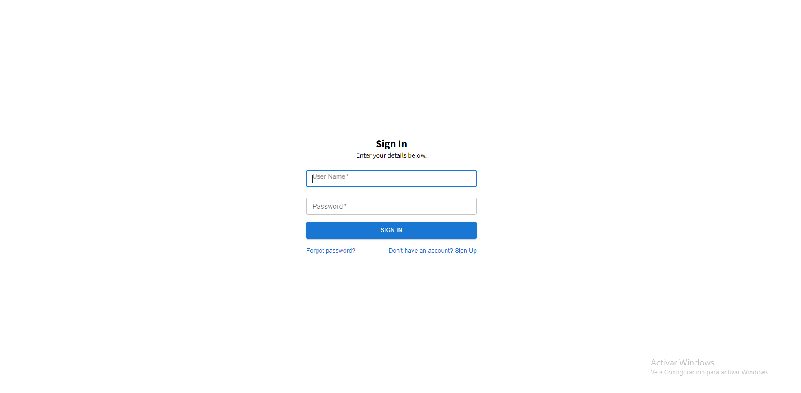
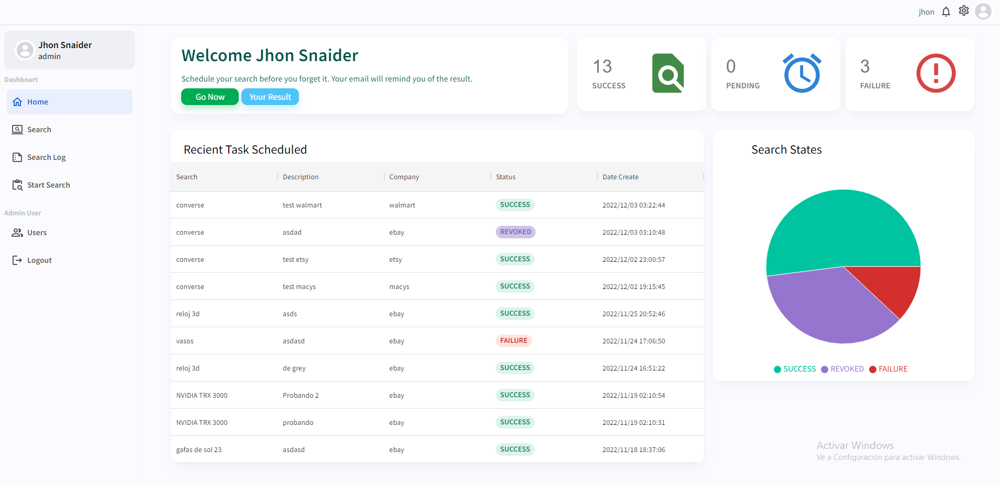
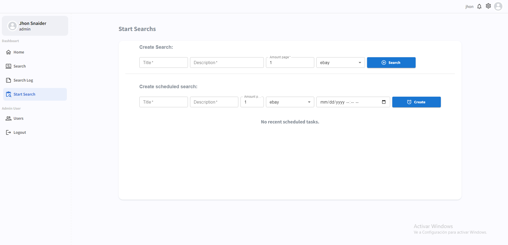
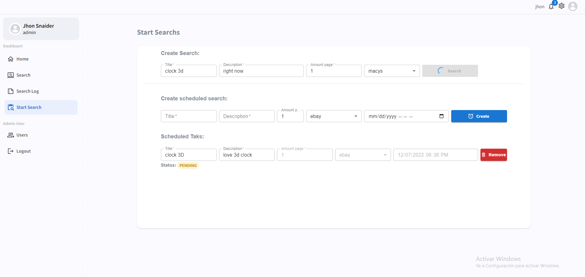
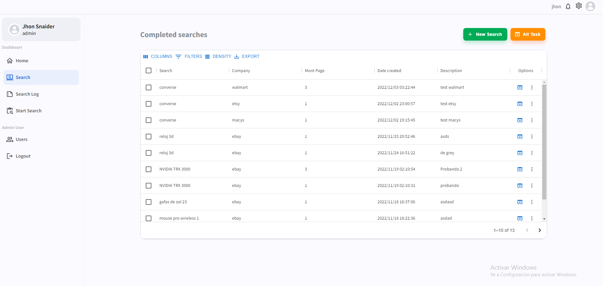
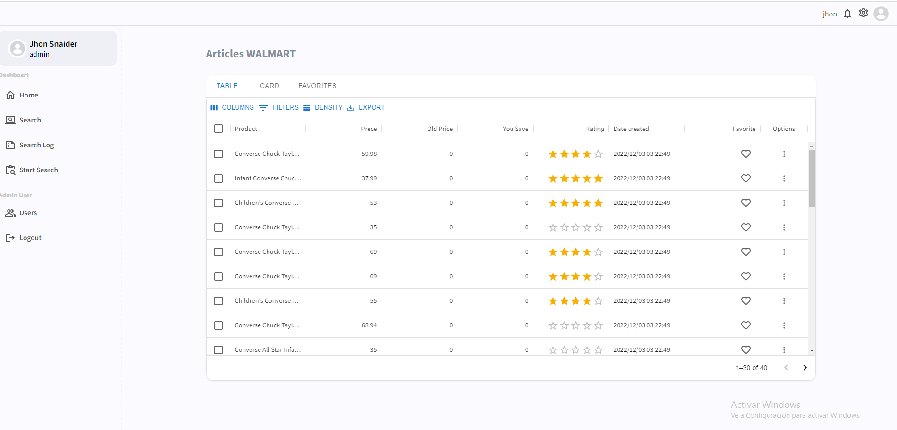
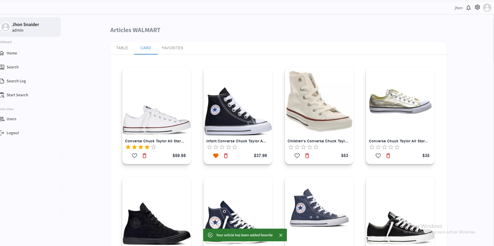
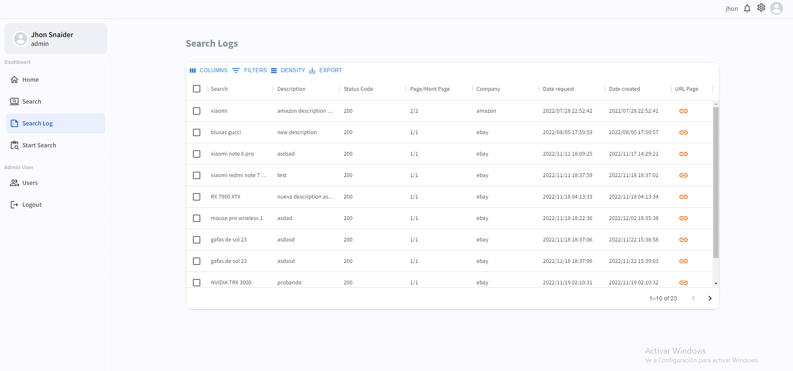
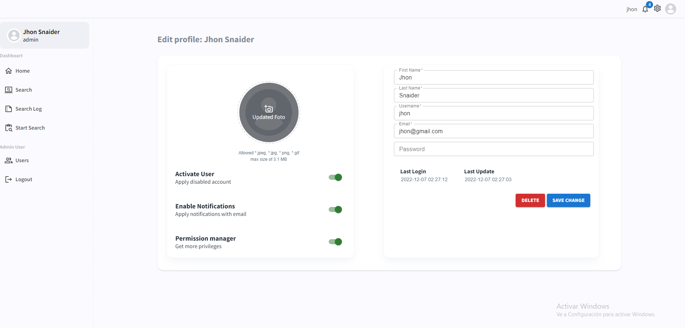
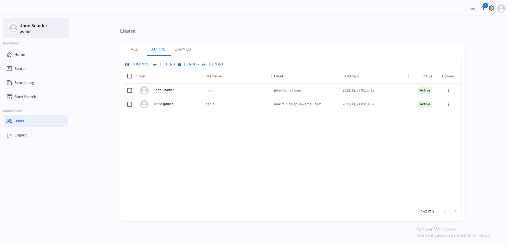

# Django + Celery + PostgreSQL + React JS + Material UI

## Description
System based on web scraping, creating scheduled tasks on a specific day.
Storing product data from different stores, adding these to favorites and being able to make comparisons in the marking

## Installation 
***You can use docker container if preferred.***

### Backend
`First install python interpreter and after install virtual enviroment.`
```python3
$ pip3 install virtualenv

```

### Install Requirements
```
$ cd backend
$ pip3 install requirements.txt
```
Config base Datos in Django
### Make Migrations Django to DB
```
$ cd backend
$ python manage.py makemigrations
$ python manage.py migrate
```


### Install Redis Server
[Redis-Doc](https://developer.redis.com/create)

### Check Settings Django, Celery and Redis Server
[Redis-Doc](https://docs.celeryq.dev/en/stable/django/first-steps-with-django.html)
### Verify Celery Runs
Linux
```
celery -A config worker -l INFO 
```
Windows (Use library gevent. Compatibility problems higher version 5.0 in celery)
```
celery -A config worker -l INFO -P gevent
```

### Fontend
`I use install --force Material UI have problem @mui/styles with react version ^18`
```node
cd frontend/gui
$ npm install --force
```










